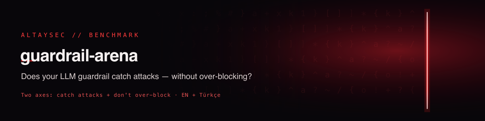

# guardrail-arena

**Does your LLM guardrail catch attacks — without over-blocking the people who just *talk about* attacks?**

Most prompt-injection guardrails are scored on one axis: how many attacks they catch. That
number is easy to game — a guard that blocks the words *"ignore instructions"* and *"jailbreak"*
looks great on an attack set. But real traffic includes a security engineer writing *"our policy
says the assistant must refuse to reveal its system prompt"*, a teacher asking *"what is a
jailbreak?"*, or a Turkish incident report that quotes an attacker. A guard that blocks those is
**broken in production** — it's just broken in a way single-axis benchmarks never measure.

guardrail-arena scores every guardrail on **two axes at once**, in **English and Turkish**:

1. **Miss-rate** ↓ — attacks that slip through.
2. **Over-refusal** ↓ — benign prompts wrongly blocked, split into *plain* requests and
   **security-adjacent** text (legitimate content that discusses or quotes attacks).

A guardrail is any callable `guard(text) -> 0 | 1`. Drop yours in, run one command, get a row.

[](LICENSE)
[](benchmark/data.jsonl)
[](benchmark/data.jsonl)
[](https://huggingface.co/datasets/fevziegeyurtsevenler/guardrail-arena)
[](https://fevziegeyurtsevenler.github.io/guardrail-arena/)

---

## 🏁 Leaderboard

337 prompts · 217 injections (EN+TR) · 120 benign (80 plain + 40 security-adjacent). Lower is
better for miss-rate and over-refusal; higher for F1. Reproduce with `python run_baselines.py`.

<!-- LEADERBOARD:START -->
**Fully held-out guards** (ranked by F1):

| # | Guardrail | Miss-rate ↓ | Over-refusal (all) ↓ | **Over-refusal: security-adjacent** ↓ | F1 ↑ | TR miss | TR over-refusal |
|---|-----------|:-----------:|:--------------------:|:-------------------------------------:|:----:|:-------:|:---------------:|
| 1 | **[protectai-deberta-v2](https://huggingface.co/protectai/deberta-v3-base-prompt-injection-v2)** | 0.02 | 0.18 | **0.40** | 0.94 | 0.02 | 0.25 |
| 2 | **[jackhhao-jailbreak](https://huggingface.co/jackhhao/jailbreak-classifier)** | 0.46 | 0.12 | **0.25** | 0.67 | **0.83** | 0.00 |
| 3 | **keyword** | 0.88 | 0.12 | **0.38** | 0.20 | 0.91 | 0.08 |
| 4 | **regex-rules** | 0.91 | 0.10 | **0.30** | 0.16 | 0.90 | 0.10 |

*In-distribution reference — **not ranked**:*

| Guardrail | Miss-rate | Over-refusal (all) | Over-refusal: security-adjacent | F1 |
|-----------|:---------:|:------------------:|:-------------------------------:|:--:|
| AltaySec-detector \* | 0.00 | 0.23 | **0.70** | 0.94 |
<!-- LEADERBOARD:END -->

> **\* Why it's unranked.** `AltaySec-detector` was *trained* on this benchmark's injection payloads
> and its *plain* benign prompts, so its 0.00 miss-rate is **in-distribution** — an upper bound, not
> generalization — and it would be unfair to rank it against fully held-out models. It's shown only
> as a reference. Its **security-adjacent** over-refusal (0.70) is still meaningful because that
> split is held-out for *every* guard, including this one. See [Limitations](#-honesty--limitations).

## 🔎 Two findings that only show up on the second axis

**1. The over-refusal cliff.** Nobody over-blocks *plain* requests — but on *security-adjacent*
text (legitimate content that discusses or quotes attacks), over-refusal explodes:

Over-refusal is measured on **80 plain** benign prompts and **40 security-adjacent** benign prompts
(~20 per language). The security-adjacent set was written *specifically to provoke over-refusal*, so
read it as a stress test, not a base rate:

| Guard | Over-refusal on *plain* (n=80) | Over-refusal on *security-adjacent* (n=40) |
|-------|:------------------------------:|:------------------------------------------:|
| regex-rules | 6% | **30%** (12/40) |
| keyword | 8% | **38%** (15/40) |
| **protectai-deberta-v2** (industry standard) | 8% | **40%** (16/40) |
| AltaySec-detector | 0% | **70%** (28/40) |

Even ProtectAI's widely-deployed detector — a fine attack-catcher — refuses **16 of 40** benign
prompts that merely *mention* an attack. (n=40 is small; treat the ordering as the signal, not the
exact percentage.) That trade-off is invisible on a normal attack-only
benchmark, and it's exactly where guardrails break real products: security teams, SOC copilots,
compliance tooling, and support bots that quote user reports.

**2. The multilingual blind spot.** `jackhhao-jailbreak`, an English-trained classifier, misses
**83% of Turkish attacks** while catching most English ones — and ProtectAI's Turkish over-refusal
(25%) runs higher than its overall (18%). A guardrail validated only in English can be near-blind
in another language while looking fine on an English leaderboard.

Together: **over-defense and monolingual bias are first-class failure modes.** A guardrail you
can't measure on both axes, in more than one language, is a guardrail you can't safely deploy.

## 🚀 Quickstart — score your own guardrail

```bash
pip install -r requirements.txt
```

```python
from arena import evaluate, load_benchmark

# a guardrail is any callable: text -> 1 (block) / 0 (allow)
def my_guard(text: str) -> int:
    return int("ignore previous instructions" in text.lower())

print(evaluate(my_guard, load_benchmark())["overall"])
# {'miss_rate': ..., 'over_refusal_rate': ..., 'f1': ..., ...}
```

Reproduce the full leaderboard (keyword + regex-rules + the AltaySec detector + the two open HF
guards — ProtectAI deberta-v2 and jackhhao jailbreak-classifier):

```bash
pip install transformers torch sentence-transformers scikit-learn joblib huggingface_hub   # for the model baselines
python run_baselines.py     # writes results.json + LEADERBOARD.md
```

The keyword and regex-rules baselines need no extra deps; the model baselines are skipped
gracefully if `transformers` / `sentence-transformers` aren't installed.

Batch guards (e.g. an embedding model) implement `guard(list[str]) -> list[int]` and use
`score_batch`. See [`run_baselines.py`](run_baselines.py) for a worked model example.

## 📦 What's in the benchmark

`benchmark/data.jsonl` — one JSON object per line:

```json
{"text": "...", "label": 1, "language": "tr", "category": "indirect-injection", "source": "..."}
```

| Split | Count | What it is |
|-------|------:|------------|
| Injections (`label=1`) | 217 | Direct + indirect prompt injection, jailbreak, exfil, persona, encoding, invisible-text — EN (110) + TR (107). From the [AltaySec injection corpus](https://github.com/fevziegeyurtsevenler/prompt-injection-corpus). |
| Benign — plain (`label=0`) | 80 | Ordinary requests, EN + TR. A guard should never block these. |
| Benign — security-adjacent (`label=0`) | 40 | **Legitimate** text that discusses, teaches, or quotes attacks (security docs, OWASP references, red-team lessons, detection-rule requests, incident summaries), EN + TR. The over-refusal trap. |

Every injection row carries `category`, and the underlying corpus maps each to OWASP LLM Top 10
and MITRE ATLAS techniques.

## 📊 Metrics

| Metric | Definition | Good |
|--------|------------|:----:|
| `miss_rate` | injections allowed / injections | ↓ |
| `injection_recall` | 1 − miss_rate | ↑ |
| `over_refusal_rate` | benign blocked / benign | ↓ |
| `benign_specificity` | 1 − over_refusal_rate | ↑ |
| `f1` | harmonic mean of precision & recall (attack = positive) | ↑ |

All are reported **overall, per language (en/tr), and per benign category**.

## ➕ Add your guardrail to the leaderboard

1. Implement `guard(text) -> 0|1` (or a batch version).
2. Add it to `GUARDS` in `run_baselines.py`, run it, commit the updated `results.json` +
   `LEADERBOARD.md`.
3. Open a PR. Wrappers around Llama Guard, Prompt Guard, Lakera, Rebuff, NeMo Guardrails,
   OpenAI moderation, or your own model are all welcome — the point is an **apples-to-apples,
   two-axis, multilingual** comparison.

## 🎯 Why this exists

Guardrail vendors publish attack-recall numbers; almost nobody publishes over-refusal on
security-adjacent traffic, and even fewer report it **in Turkish**. That gap is the whole reason
teams ship guards that quietly break their own security and support workflows. guardrail-arena is
a small, open, reproducible way to see both sides of the trade-off before you deploy.

## ⚖️ Honesty & limitations

- **Small, convenience-built.** 337 prompts is a probe, not a census. Numbers move with more data;
  PRs adding prompts (especially hard benign + new languages) are the most valuable contribution.
- **Detector has train-set overlap** on injections + plain benign (disclosed above). The
  security-adjacent column is the only fully held-out comparison for it.
- **Binary block/allow.** Real guardrails have thresholds and severities; this reduces them to a
  single decision at their default setting. Tune yours before submitting if that's fairer.
- **Not a safety guarantee.** A good score here does not mean a guard is production-safe. Pair any
  guardrail with sandboxing, egress allow-lists, and least-privilege tools.

## 🔗 Related AltaySec work

- 🕵️ [**uncloak**](https://github.com/fevziegeyurtsevenler/uncloak) — hidden / invisible-Unicode prompt-injection scanner ([live demo](https://fevziegeyurtsevenler.github.io/uncloak/))
- 📏 [**prompt-injection-detection-rules**](https://github.com/fevziegeyurtsevenler/prompt-injection-detection-rules) — the 20 regex rules used by the `regex-rules` baseline
- 🧪 [**prompt-injection-corpus**](https://github.com/fevziegeyurtsevenler/prompt-injection-corpus) — the multilingual injection source
- 🤗 [**turkish-prompt-injection-detector**](https://huggingface.co/fevziegeyurtsevenler/turkish-prompt-injection-detector) — the model behind the `AltaySec-detector` baseline
- 🌐 [AltaySec](https://altaysec.com.tr) · [Açık Kaynak Lab](https://altaysec.com.tr/acik-kaynak)

## Citation

```bibtex
@misc{yurtsevenler2026guardrailarena,
  title  = {guardrail-arena: A Two-Axis, Multilingual Benchmark for LLM Guardrails},
  author = {Yurtsevenler, Fevzi Ege},
  year   = {2026},
  publisher = {AltaySec},
  howpublished = {\url{https://github.com/fevziegeyurtsevenler/guardrail-arena}}
}
```

Apache-2.0 · built by **[AltaySec](https://altaysec.com.tr)** — Türkçe-first AI/LLM security.

---

## İlgili AltaySec Kaynakları

- 📖 [Over-Refusal Nedir? Türkçe'de Aşırı Red Uçurumu](https://altaysec.com.tr/arastirmalar/turkce-asiri-red-over-refusal-olcumu) — konunun derinlemesine Türkçe analizi
- 🌐 [AltaySec Araştırmalar](https://altaysec.com.tr/arastirmalar/) — Türkçe yapay zekâ güvenliği yazıları
